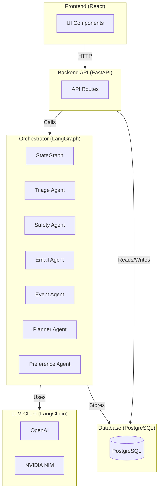
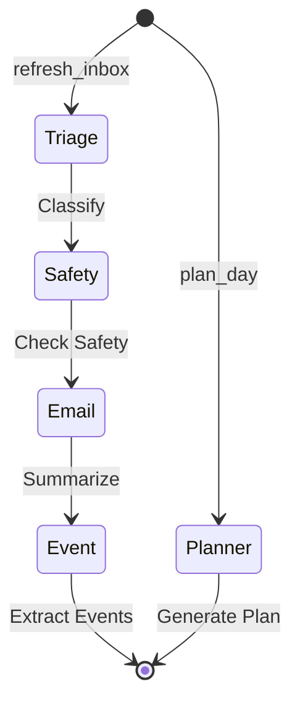

# Personal Ops Center

<div align="center">

**An intelligent multi-agent AI system for personal productivity automation**

[](https://www.python.org/)
[](https://fastapi.tiangolo.com/)
[](https://reactjs.org/)
[](https://www.langchain.com/)
[](https://github.com/langchain-ai/langgraph)

</div>

---

## Overview

Multi-agent AI system that automates email triage, calendar management, and daily planning using **LangChain** and **LangGraph** for intelligent agent orchestration.

**Key Features:**
- Parallel tool execution (DAG executor) with multi-layer caching (plan/LLM/tool)
- 126K-token context with auto-compaction for long-running chats
- Real-time visual feedback (Cursor-style highlights, ghost previews, progress timeline)
- Intelligent email triage + drafting, calendar creation, weather insights, daily planner
- Safety checks, preference learning, and structured action approvals
- Full-page chat assistant with streaming responses

---

## Quick Start

### Prerequisites

- Docker & Docker Compose (for Postgres; Redis optional)
- Python 3.10+
- Node 18+
- AI Provider API Key (OpenAI or NVIDIA NIM)

### Setup

1. **Clone and configure**
   ```bash
   git clone https://github.com/Sant0-9/Mini-os.git
   cd multiagents
   cp env.example .env
   # Edit .env and add your API key(s)
   ```

2. **Install dependencies (first run)**
   ```bash
   python -m venv .venv && source .venv/bin/activate
   pip install -r requirements.txt
   cd frontend && npm install && cd ..
   ```

3. **Start services (local backend/frontend + Dockerized Postgres)**
   ```bash
   ./start.sh
   # Stop everything later with: ./stop.sh
   ```

4. **Access**
   - Frontend: http://localhost:3101
   - API Docs: http://localhost:8101/docs

**Optional caching (Redis)**
- Start Redis for LLM/tool/plan caching: `docker compose -f docker-compose.yml up -d redis`
- Or set `REDIS_URL` to your own instance; in-memory fallback is used if Redis is unavailable.

**Docker Compose file selection**
- By default `./start.sh` uses `docker-compose.yaml` (contains `postgres`, `backend-api`, `frontend` services).
- If you need to use a different compose file, set `COMPOSE_FILE_PATH`, e.g. `COMPOSE_FILE_PATH=docker-compose.yml ./start.sh`.
- Ensure the compose file you point at contains the `postgres` service; otherwise start will fail.

**Enable enhanced agent (parallel + caching)**
```bash
export USE_ENHANCED_AGENT=true
# also set REDIS_URL if you want persistent caches
```

---

## Architecture

### System Overview



### Agent Workflow



---

## Technology Stack

- **Frontend**: React 18 + TypeScript + Vite
- **Backend**: FastAPI + SQLAlchemy + Alembic
- **AI**: LangChain + LangGraph + OpenAI/NVIDIA NIM
- **Database**: PostgreSQL

---

## API Endpoints

- `POST /api/chat/message` - Chat with streaming + tool execution (Enhanced agent via `USE_ENHANCED_AGENT=true`)
- `GET /api/inbox` - List inbox items, threads, summaries
- `GET /api/planner/today` - Get today's plan
- `GET/POST/PUT/DELETE /api/calendar/events` - Calendar CRUD + Google Calendar sync
- `GET /api/weather/current`, `GET /api/weather/forecast` - Weather + 7-day forecast
- `GET /api/actions/pending` / `POST /api/actions/{id}/approve|reject` - Action approvals
- `WS /api/realtime/agent/{session_id}` - Agent event stream (highlights, previews, progress)
- `SSE /api/realtime/sse/inbox|calendar|weather` - Live UI updates for data refreshes

Full API docs: http://localhost:8101/docs

---

## Agents

| Agent | Purpose |
|-------|---------|
| **Triage** | Classifies and prioritizes emails/events |
| **Email** | Summarizes emails and generates drafts |
| **Event** | Extracts calendar events from emails |
| **Planner** | Generates daily plans with time blocks |
| **Safety** | Detects scams and assesses risks |
| **Preference** | Learns from user feedback |
| **Enhanced (flagged)** | Parallel tool execution, caching, loop prevention, visual feedback |

---

## Development

```bash
# Backend
pip install -r requirements.txt
uvicorn backend.api.server:app --reload --port 8101

# Frontend
cd frontend && npm install && npm run dev

# Run tests
pytest
```

---

## License

MIT License
