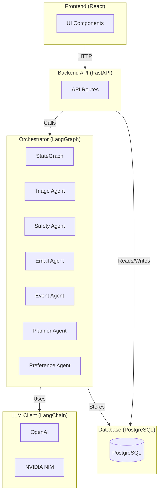
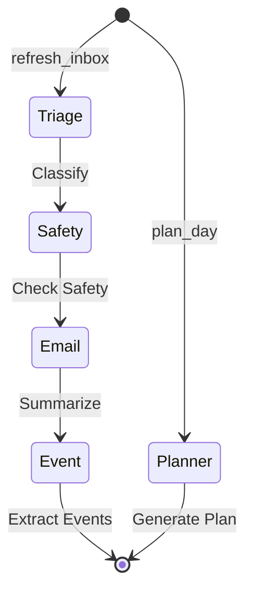

# Personal Ops Center

<div align="center">

**An intelligent multi-agent AI system for personal productivity automation**

[](https://www.python.org/)
[](https://fastapi.tiangolo.com/)
[](https://reactjs.org/)
[](https://www.langchain.com/)
[](https://github.com/langchain-ai/langgraph)

</div>

---

## Overview

Multi-agent AI system that automates email triage, calendar management, and daily planning using **LangChain** and **LangGraph** for intelligent agent orchestration.

**Key Features:**
- Cursor-style live visual feedback (element highlights, ghost previews, progress timeline)
- Intelligent email classification and prioritization with drafting
- Calendar event extraction and proposals
- AI-powered daily planning
- Scam detection and safety checks
- Preference learning from user feedback
- Full-page chat assistant

---

## Quick Start

### Prerequisites

- Docker & Docker Compose
- AI Provider API Key (OpenAI or NVIDIA NIM)

### Setup

1. **Clone and configure**
   ```bash
   git clone https://github.com/Sant0-9/Mini-os.git
   cd multiagents
   cp env.example .env
   # Edit .env and add your API key
   ```

2. **Start services (local backend/frontend + Dockerized Postgres)**
   ```bash
   ./start.sh
   # Stop everything later with: ./stop.sh
   ```

3. **Access**
   - Frontend: http://localhost:3101
   - API Docs: http://localhost:8101/docs

**Docker Compose file selection**
- By default `./start.sh` uses `docker-compose.yaml` (contains `postgres`, `backend-api`, `frontend` services).
- If you need to use a different compose file, set `COMPOSE_FILE_PATH`, e.g. `COMPOSE_FILE_PATH=docker-compose.yml ./start.sh`.
- Ensure the compose file you point at contains the `postgres` service; otherwise start will fail.

---

## Architecture

### System Overview



### Agent Workflow



---

## Technology Stack

- **Frontend**: React 18 + TypeScript + Vite
- **Backend**: FastAPI + SQLAlchemy + Alembic
- **AI**: LangChain + LangGraph + OpenAI/NVIDIA NIM
- **Database**: PostgreSQL

---

## API Endpoints

- `GET /api/inbox` - List inbox items
- `GET /api/planner/today` - Get today's plan
- `GET /api/actions/pending` - List pending actions
- `POST /api/actions/{id}/approve` - Approve action
- `POST /api/chat/message` - Chat with AI assistant

Full API docs: http://localhost:8101/docs

---

## Agents

| Agent | Purpose |
|-------|---------|
| **Triage** | Classifies and prioritizes emails/events |
| **Email** | Summarizes emails and generates drafts |
| **Event** | Extracts calendar events from emails |
| **Planner** | Generates daily plans with time blocks |
| **Safety** | Detects scams and assesses risks |
| **Preference** | Learns from user feedback |

---

## Development

```bash
# Backend
pip install -r requirements.txt
uvicorn backend.api.server:app --reload --port 8101

# Frontend
cd frontend && npm install && npm run dev
```

---

## License

MIT License
